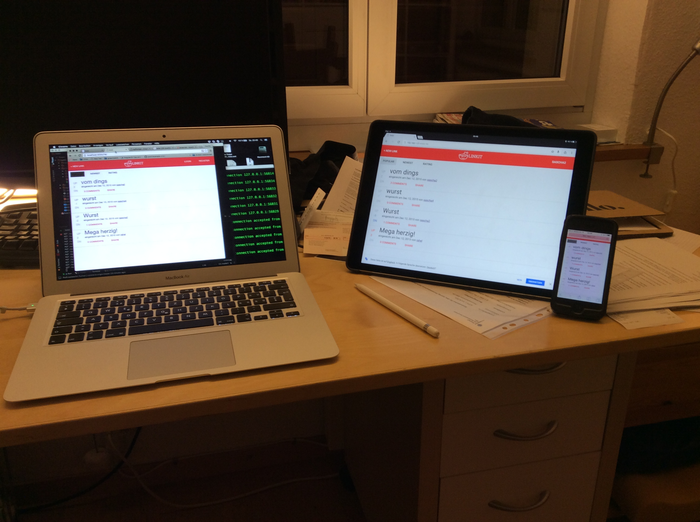

# linkit
Linkit is a simplified reddit clone build with the MEAN stack.

In addition we use typescript and jspm to make use of es6 modules in the frontend.

## Status
Link Module
- add new link
- delete your link

Comment Module
- Comment any link

Rating Module
- Rate link
- Rate comment
- Undo link or comment rate

User Module
- Register new User / Login
- change your password
- delete your Account

Security Module
- User Login
- User Logout
- Only Users who are logged in are allowed to create a link, comment and rate

Additional
- Performance (one Package for JS, HTML and CSS)
- WCAG (added ng-aria)

##linkit is built with:
 * [Node.js](http://www.nodejs.org/)
 * [MongoDB](http://www.mongodb.org/)
 * [Mongoose 4.2](http://mongoosejs.com/)
 * [Typescript 2.10](http://www.typescriptlang.org/)
 * [SCSS 2.1](http://sass-lang.com/)
 * [jspm 0.16](http://jspm.io/)
 * [Express 4.13](http://expressjs.com/)
 * [AngularJS 1.4](http://angularjs.org/)
 * [Angular Material 0.11](https://material.angularjs.org)


## Setup
You need the following binaries installed:
- [node](https://nodejs.org/)
- [npm](https://www.npmjs.com/)
- [mongodb](https://docs.mongodb.org/manual/tutorial/install-mongodb-on-os-x/)

We tested with local installation of:
- node (>0.12.8)
- npm (>2.14.4)
- mongodb (3.0.6)
- gulp (3.9.0)

```sh
# Install Gulp and Typescript globally
$ npm install -g gulp tsd

# Install project Node dependencies
$ npm install
```

## Development
```sh
# Run primary daemon process for MongoDB system
$ mongod
# Start Node Server and Gulp Task by running
$ gulp serve
```

## Production
```sh
# Run NPM Bundle to build dist Folder
$ npm run bundle
# Run primary daemon process for MongoDB system
$ mongod
# Start Node Server and Gulp Task by running
$ gulp serve
```
Run this Site to access production build [http://localhost:3000/index2.html](http://localhost:3000/index2.html)

## Build and test
```sh
$ gulp
```

# Requirements
## Device Lab


## Tests
We use following Test Libraries for Unit and integration Tests:
* [Karma](http://karma-runner.github.io/0.13/index.html)
* [Mocha](http://mochajs.org/)
* [Chai](http://chaijs.com/)

## Usertests
### Userin 1

- login / register, username / password no length validation
- If user / password is wrong, display a message
- On Title details, display time and user only
- If User removes a Topic or Comment, ask if ok to delete
- Seperate change Password and remove Account on Account Page
- add Cloak
- add Breadcrumb for better orientation

### Userin 2

- Detail page is not obvious (I have to click on comments to see details)
- URL is not shown on detail (better for UX, what do I click here)
- Title on detail links to home site not to website (url)
- After password change form is wrong
- After comment a Topic form is wrong
- Title on Mobile is cutted
- Newest Topic is at the bottom
- URLs with https are not working (it writes https//)
